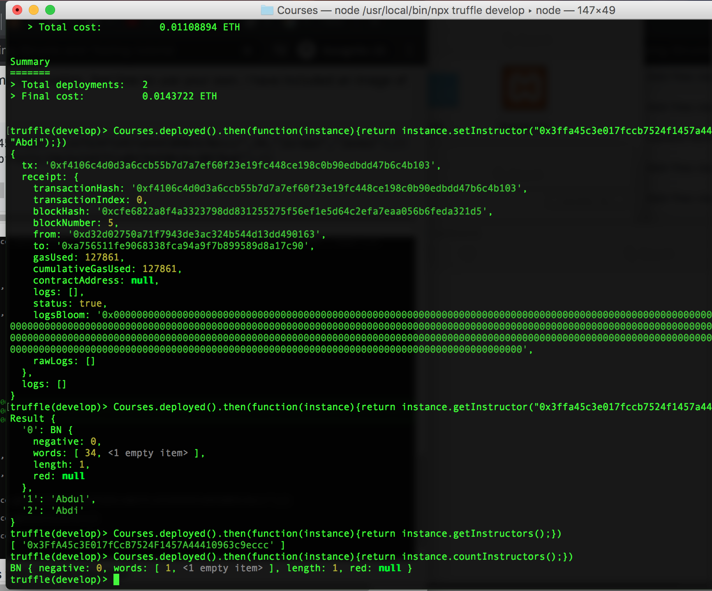

# Solidity-Mappings-Structs-Tutorial
Name: Abdullahi Abdi    
Class: CSC 4980 / 6980 Blockchain & Applications    

Steps to run the code:
I have an NPM package manager,so before any of the truffle commands I have to type npx, for people who didn't use an NPM package manager to get truffle and the corresponding programs they can ignore the npx command.

1) Assuming you have pre-downloaded truffle and solidity, if not run the following two commands in your command prompt/ termindal to have truffle and solidity downloaded for you.      
    
        
npm i -g truffle    
npm i -g solc   

2) Now we have to create a courses folder to do our tutorial in. I suggest in the Desktop folder, but you can make this folder wherever you can easily gain access to it. To do so in terminal run the following commands(after being in the location you want to make the new folders).        
      
          
          
mkdir Courses   
cd Courses    
npx truffle init    

3) Now we must create the courses contract .sol file. To do so type in the following command.   
npx truffle create contract Courses   

4) This tutorial's code is a little old, so we have to update it to our version of solidity. But before that, if you check in your Courses contract folder you will see a Courses.sol and Migrations.sol. Open the courses.sol and copy the following code, it's really similar to the tutorial one just with the updated version.    
pragma solidity ^0.5.0;

contract Courses {

  struct Instructor {

    uint age;
    string fName;
    string lName;
  }

  mapping (address => Instructor) instructors;
  address[] public instructorAccts;
  constructor() public{
  }
  function setInstructor(address _address, uint _age, string memory _fName, string memory _lName) public {
    //var instructor = instructors[_address];

    instructors[_address].age = _age;
    instructors[_address].fName = _fName;
    instructors[_address].lName = _lName;    

    instructorAccts.push(_address) -1;
  }

  function getInstructors() view public returns(address[] memory) {
    return instructorAccts;
  }

  function getInstructor(address _address) view public returns (uint, string memory, string memory) {
    return (instructors[_address].age, instructors[_address].fName, instructors[_address].lName);
  }
  
  function countInstructors() view public returns (uint) {
    return instructorAccts.length;
  }
}   
    
        
 5) Now in the migrations folder, created a new file called 2_deploy_contracts.js, and copy the following code into that newly created file.    
 var Courses = artifacts.require("./Courses.sol");
 
module.exports = function(deployer) {
  deployer.deploy(Courses);
}

This is the javascraipt file we need to deploy the contract on the Ethereum blockchain.   

6) Now we test to make sure everything is working properly. Again make sure you are still in your Courses folder and run the following commands.    
npx truffle compile   
npx truffle develop   

7)Now that we were able to confirm that our code was running just fine, we will re-run the migration. To do so run the following commands.     
migrate --reset --all (make sure you are in truffle develop mode while typing this, and when you are trying to get out of the truffle develop mode type in .exit to exit).    

8) Now testing the our contract to make sure that if we put in fname and lname that our contract will work. For my example i used my name Abdullahi Abdi, but you can use whatever name in substitute. So now, when you are still in truffle develop, type in the following commands and it should give you the set the instructor, return the name of set instructor with that #, return all the instructors, then return how many instructors we have(in our case just 1, so length=1).     

Courses.deployed().then(function(instance){return instance.setInstructor("0xD32d02750a71f7943DE3AC324b544D13dD490163",34,"Abdullahi","Abdi");})   
Courses.deployed().then(function(instance){return instance.getInstructor("0xD32d02750a71f7943DE3AC324b544D13dD490163");})   
Courses.deployed().then(function(instance){return instance.getInstructors();})    
Courses.deployed().then(function(instance){return instance.countInstructors();})    

